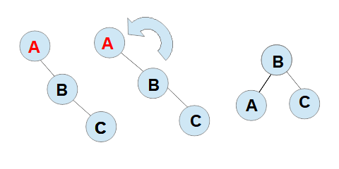
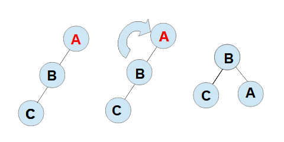
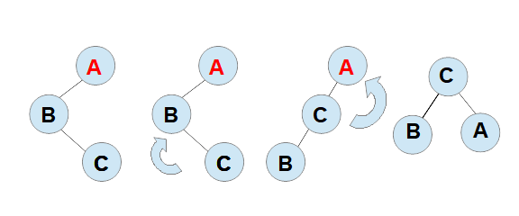
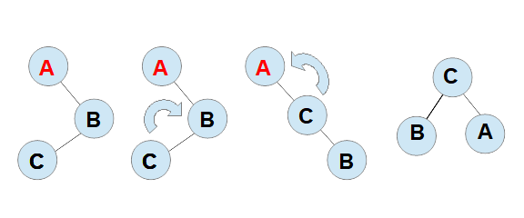

# AVL Tree
The AVL Tree is similar to the Binary Search Tree, but in an AVL Tree we have some strategies in place to avoid the tree to be unbalance.
To keep our tree balance, first we have to iundersatand concept of a node height. The node heigh is the disctance between this node and the leave below it. Hence we must be sure that the difference between the heigh of two sibbiling nodes is 1 or -1 or 0.

## Requirements
Here you will find tree directories: dist (where the executable files will be created), include (where the header file can be find with the data structure definition) and src (where you can find the "c" file witht the data structure implementation)

You must have instaled in your computer a c compiler and make to be able to execute the commands.

### Compiling
To compile the code in the binaryTree folder execute the comand:

```
make compile
```

### Executing 
To execute  the code alread compiled execute the comand:

```
make run
```

### Clean
To clean the executable file once it is compiled, execute the comand:

```
make clean
```

## Implementation

### Node
The start point of the tree implementation is the struct "Node":

```
typedef int TYPEKEY;

typedef struct aux {
    TYPEKEY key;
    struct aux *left, *right;
    int h;
} NODE;
```

### Start a tree
To create a tree is simple as return a NULL value that will represent a empty tree:

```
POINTER startup() {
   return(NULL);
}
```


### Create a new node
To create a node we must set the struct properties, note that the heigh is set to 0, what makes sense, because the  node must be in a tree to have a heigh.  

```
POINTER createNode(TYPEKEY key) {
    POINTER newNODE = (POINTER) malloc(sizeof(NODE));
    newNODE->left = NULL;
    newNODE->right = NULL;
    newNODE->key = key;
    newNODE->h = 0;
    return (newNODE);
}
```
### Rotation operations
Once we have figures out that a insert or delete operation made the tree unbalance, it means the difference high between two sibiling nodes is not -1 or 1 or 0, we should make the apropriate turn operation to keeo the tree balanced.

There are basically two kind where we need to apply rotation, in a external node and in internal node. The external nodes are the nodes that are in the left of a left node or in the right of the right node. Hence the external node is a right node of a node in the left, or a left node of a node in the right.

For external node just one rotation is enought the solve the problem.


#### Left rotation



```
POINTER turnLeft(POINTER root) {
    POINTER aux;
    aux = root->right;
    root->right = aux->left;
    aux->left = root;

    root->h = max(heigh(root->right), heigh(root->left)) + 1;
    aux->h = max(heigh(aux->right), root->h) + 1;
    return(aux);
}

```

#### Right Rotation


```
POINTER turnRight(POINTER root) {
    POINTER aux;
    aux = root->left;
    root->left = aux->right;

    root->h = max(heigh(root->right), heigh(root->left)) + 1;
    aux->h = max(heigh(aux->left), root->h) +1;
}
```



```
POINTER turnLeftRight(POINTER root) {
    root->left = turnLeft(root->left);
    return(turnRight(root));
}
```




```
POINTER turnRightLeft(POINTER root) {
    root->right = turnRight(root->right);
    return(turnLeft(root));
}
```